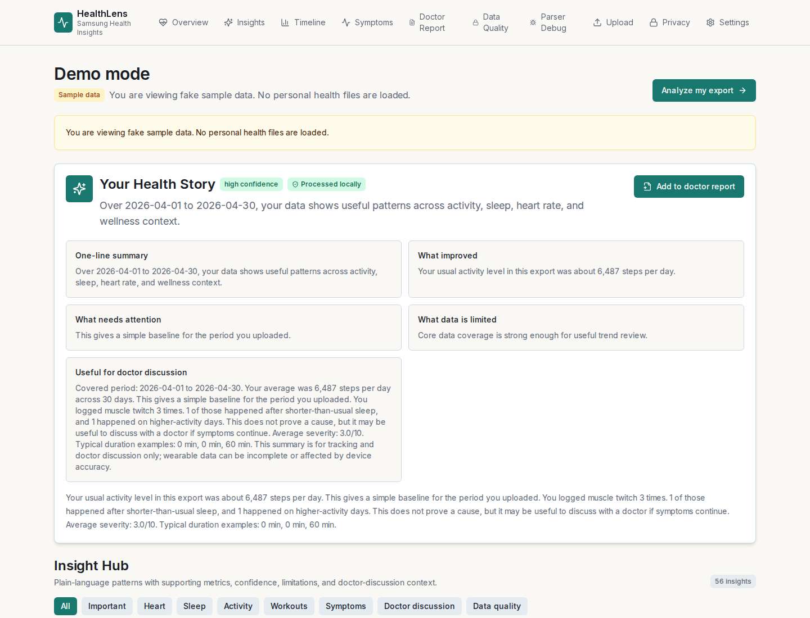
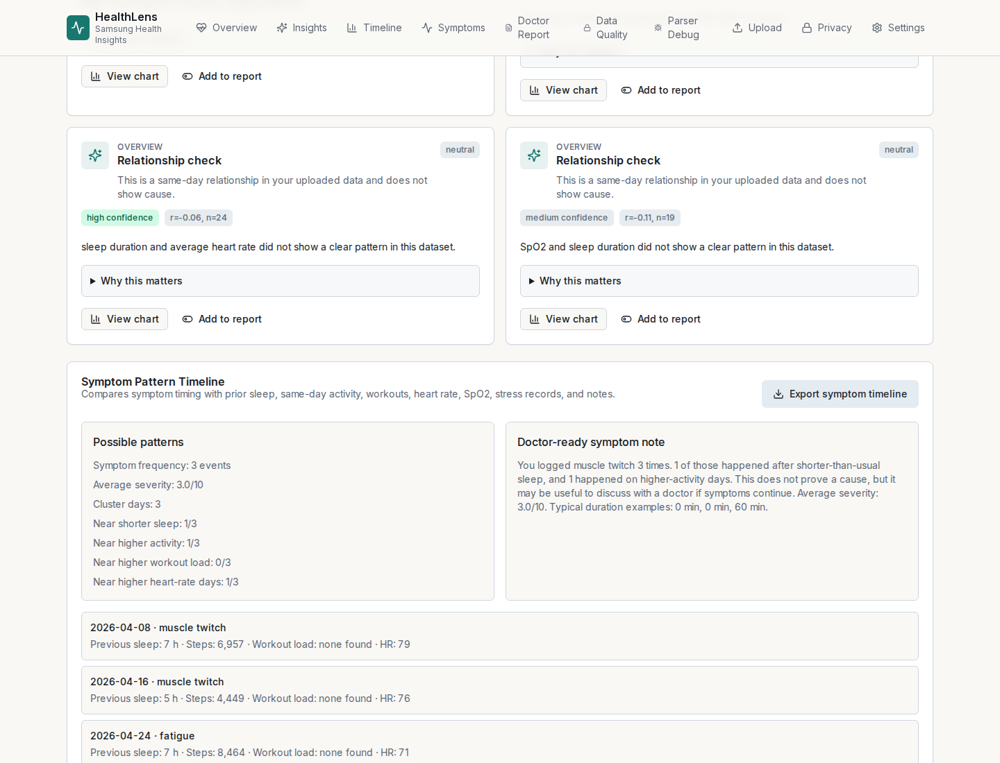
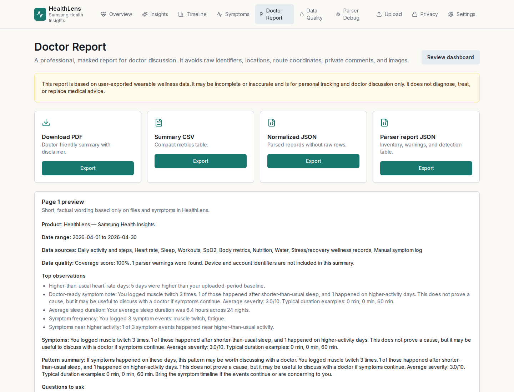
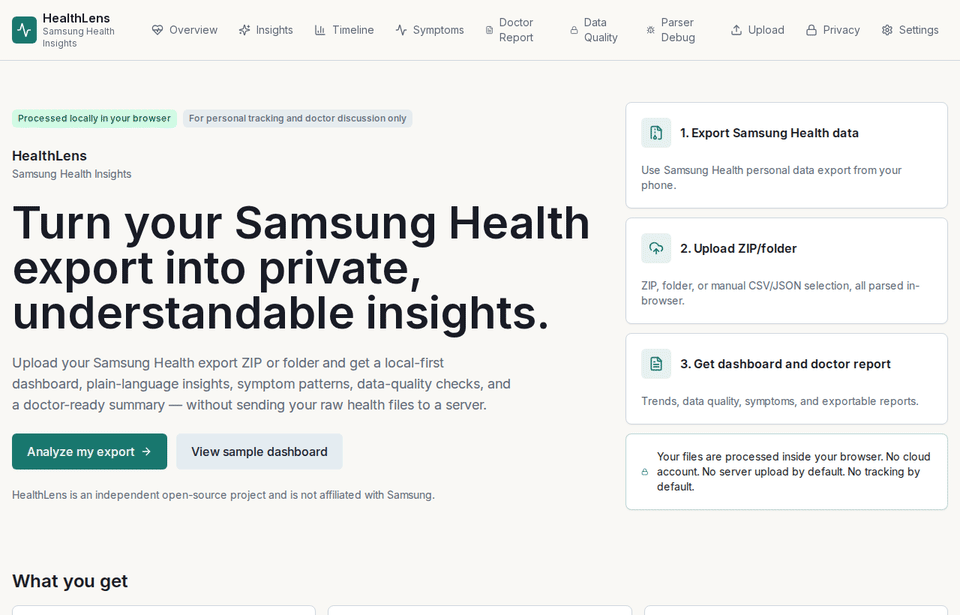

# HealthLens — Samsung Health Insights

Private, local-first health insights from Samsung Health exports.


HealthLens turns a Samsung Health export ZIP or extracted folder into a private, understandable dashboard with plain-language insights, symptom patterns, data-quality checks, and doctor-ready reports. Raw health files are processed locally in the browser by default.

GitHub description: Private, local-first health insights and doctor-ready reports from Samsung Health data exports.

HealthLens is an independent open-source project and is not affiliated with, endorsed by, or connected to Samsung Electronics Co., Ltd.

## Screenshots

Release screenshots are generated from fake sample data in `/demo`:



| Insight Hub | Symptom patterns |
| --- | --- |
|  |  |

| Doctor report | Demo flow |
| --- | --- |
|  |  |

## Architecture

```text
User ZIP/folder
  -> Browser file picker
  -> Web Worker parser
  -> Samsung CSV metadata/header handling
  -> Normalized health models
  -> Analytics + insight engine
  -> Dashboard + Insight Hub + Doctor report
```

## Why This Project Exists

Samsung Health exports contain useful personal history, but raw CSV files are difficult for normal users to interpret. HealthLens focuses on clear personal patterns:

- What improved?
- What needs attention?
- What days were unusual compared with your baseline?
- What data is missing, sparse, or unreliable?
- What might be useful for a doctor discussion?

## What Makes It Different

- Local-first parsing by default.
- Samsung CSV behavior is preserved: line 1 metadata, line 2 real header, line 3 onward data.
- Insight Intelligence Layer above normalized data, not inside the parser.
- Symptom logs can be compared with sleep, steps, heart rate, workouts, SpO2, stress, water, caffeine, and notes.
- Relationship analysis uses wording like "appeared together" and "happened around the same time" instead of cause claims.
- Sparse data is called out instead of hidden.

## Privacy Promise

- Your files are processed entirely inside your browser.
- You can disconnect from the internet after loading the app, and local analysis will still work.
- Raw health files are not uploaded to a server by default.
- No cloud account is required.
- No analytics tracking is enabled by default.
- IndexedDB persistence is disabled until explicit consent.
- Delete local analysis clears uploaded data, normalized records, parser summaries, symptoms, and local settings from this browser.
- Meal/profile images and route/location data are excluded by default.

Never commit real Samsung Health exports.

## Medical Disclaimer

HealthLens is for personal tracking and doctor discussion only. Wearable data can be incomplete or inaccurate. HealthLens does not diagnose, treat, or replace medical advice.

## Supported Data Types

- Steps and activity
- Heart rate
- Sleep and sleep stages
- Workouts
- SpO2
- Body metrics
- Calories/activity
- Nutrition
- Water
- Stress/recovery wellness records
- Device/source metadata with masking
- Unknown files as unsupported inventory
- Manual symptom log
- Doctor report
- Data quality

Unsupported or inventory-only files remain visible in the parser report.

## Insight Engine

The Insight Intelligence Layer lives in `src/lib/insights/` and generates plain-language cards with:

- Category
- Title and explanation
- Supporting metric
- Confidence: high, medium, or low
- Why this matters
- Limitation when data is sparse
- Add-to-report controls
- Related chart target
- Doctor-discussion wording where relevant
- Priority score

Insight types include trend, baseline, outlier, correlation/co-occurrence, symptom pattern, data quality, sparse-data warning, and doctor-discussion insights. The safety guard in `src/lib/safety/medicalClaimGuard.ts` blocks forbidden medical-claim wording in tests and rewrites generated text in production-facing summary paths.

## Doctor Report

The doctor-ready report creates a factual summary with:

- Covered date range
- Data sources
- Data quality note
- Top objective observations
- Symptom summary
- Pattern summary
- Chart recommendations
- User notes section
- Questions to ask
- Disclaimer

Reports exclude raw device IDs, account IDs, UUIDs, locations, route coordinates, private comments, and meal/profile images.

## Demo Mode

Open `/demo` for fake generated data only. It clearly marks "Sample data" and shows the Health Story, Insight Hub, activity insights, heart insights, sleep insights, workout insights, symptom pattern example, doctor report preview, and data quality example without loading real health files.

## Export Samsung Health Data

1. Open Samsung Health on your phone.
2. Go to settings.
3. Download/export personal data.
4. Keep the ZIP private.
5. Upload it into HealthLens.

Export options may vary by Samsung Health version and region.

## Run Locally

```bash
npm install
npm run dev
```

Open `http://localhost:3000`.

## Test

```bash
npm run typecheck
npm run test
npm run build
npm run lint
```

End-to-end tests:

```bash
npm run test:e2e
```

## Contributing

See `CONTRIBUTING.md`, `ARCHITECTURE.md`, `docs/parser.md`, `docs/privacy.md`, and `docs/insights.md`.

## Security

See `SECURITY.md`. Please do not attach real health exports to issues or pull requests.
